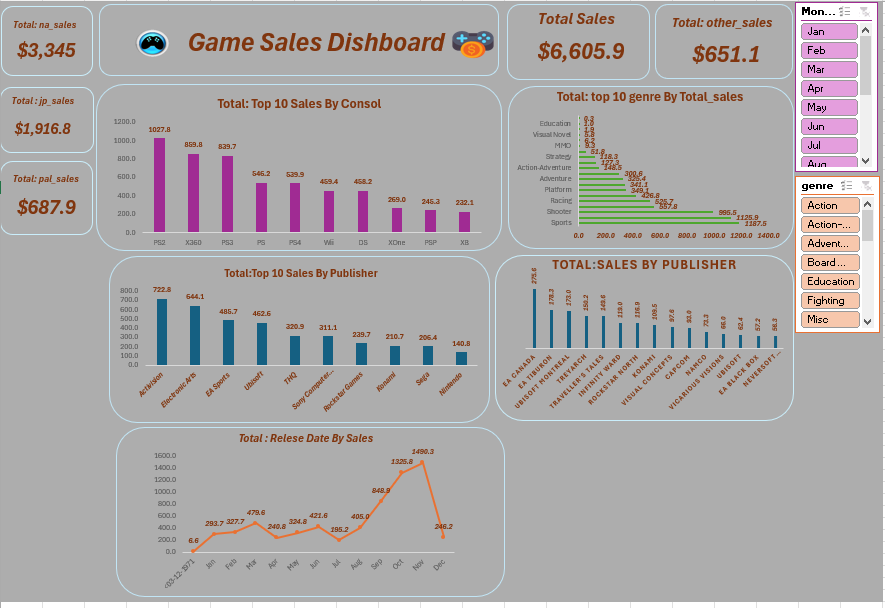

# 🎮 Game Sales Dashboard

An interactive dashboard analyzing global video game sales by region, console, publisher, and genre.  
It provides quick, data-driven insights for market trends and decision-making.

## 📊 Features
- **Regional Sales Breakdown** – North America, Japan, PAL, and others.
- **Top 10 Consoles by Sales** – Identify the most successful platforms.
- **Publisher Rankings** – See which companies dominate the market.
- **Genre Popularity** – Track sales performance by game genre.
- **Sales Over Time** – Visualize seasonal and annual trends.

## 🛠 Tools Used
- **Power BI / Excel** – For data modeling and visualization.
- **Interactive Filters** – Genre & month selectors.
- **KPIs & Graphs** – For clear and concise storytelling.

## 📷 Dashboard Preview

## 📌 Insights
- **PS2, X360, and PS3** lead in total sales.
- **Action** and **Sports** are top-selling genres worldwide.
- **October & November** show sales peaks, linked to holiday releases.
